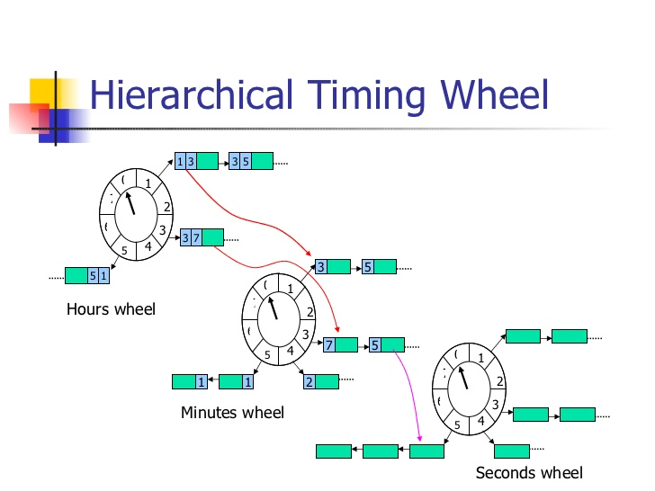

# timewheel

### 时间轮的应用场景

1. 定时器（timer）在很多工程中都有很重要的作用，通常情况下，我们需要在定时器expire之后，触发回调函数；
2. 通常在处理timer的时候，我们会使用一个线程或是协程去处理；
3. 但是如果我们需要处理很多定时器的时候，或者我们需要使用更高效的定时器的时候，时间轮是一个很好的选择；
4. 具体的场景可以是游戏中的人物的各种属性，buff之类的，当然，Linux系统中timer的实现其实也是时间轮算法；

### 时间轮示意图

1. 简单时间轮

   

2. 分层时间轮

   

### 时间轮原理

1. 把时间轮理解成一个表盘
   - 有n个刻度（scales）
   - 每个刻度之间有一定的距离（interval）
   - 每个刻度指向一组timer
2. 把timer加入时间轮
   - 根据一定的哈希函数把timer添加入某个刻度对应的组（例如 (timer.delayTime/interval)%scales）
3. 每隔interval的时间，时间轮转动一下，取出刻度处的的timer组进行处理
   - 如果是简单时间轮，对于expire的timer直接进行处理
   - 如果是分层时间轮，而且不是最后一层时间轮的话，会把timer加入下一层时间轮进行处理
   - 如果是分层时间轮，而且是最后一层时间轮的话，对于expire的timer直接进行处理
